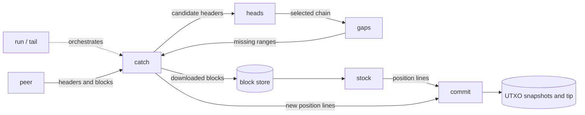
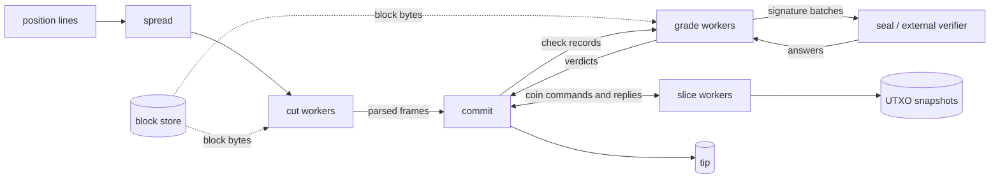

# sashimi

## 🚧 Under construction

**sashimi** is scaffolding without functionality. don't use, or do. this project aims to be a collection of unix flavoured tools, composable into bitcoin workflows. each tool does one job and communicates through streams or files, so stages can be rearranged, parallelised, or replaced.

for example:

```bash
sashimi catch data 203.0.113.7:8333 range 0 999 |
  sashimi cut data >frames
```

this fetches a thousand blocks into `data/blocks/` and streams parsed frames to
stdout.

## examples

create and serve a synthetic chain:

```bash
sashimi farm demo 300
sashimi serve demo 127.0.0.1:18333 &
```

sync a node, then follow the chain:

```bash
sashimi run node 127.0.0.1:18333
sashimi tail node 127.0.0.1:18333
```

inspect locally stored blocks and missing ranges:

```bash
sashimi stock data | head
sashimi gaps data
```

replay blocks with parallel parsers and validators while keeping 64 MiB of recent coins in memory:

```bash
sashimi stock data |
  sashimi commit data --cutters 4 --graders 4 --window 64M
```

parse blocks in parallel while preserving output order:

```bash
sashimi stock data | sashimi spread 4 cut data >frames
```

every tool supports `--help`. installing Sashimi also installs a command and man page for each tool.

## build and test

usual zig stuff, 0.16.0

```bash
zig build

# install for the current user.
zig build -Doptimize=ReleaseFast -p ~/.local

# install system wide.
sudo zig build -Doptimize=ReleaseSafe -p /usr/local

# install bare command names instead of sashimi-<tool>.
zig build -Dtools=

# cross-compile for 64-bit ARM Linux.
zig build -Dtarget=aarch64-linux -Doptimize=ReleaseFast -p ./pi

# run the test suites.
zig build test
zig build e2e

# run synthetic pipeline benchmarks.
sh test/bench.sh pi5 45
sh test/store_bench.sh 100 300
```

to uninstall, remove the installed `sashimi*` files from the prefix's `bin` and `share/man/man1` directories.

## architectural overview

`run` performs the initial sync, while `tail` continues using the same tools to follow new blocks. each tool can also be invoked and connected directly from the shell.

### sync and state



### validation pipeline


